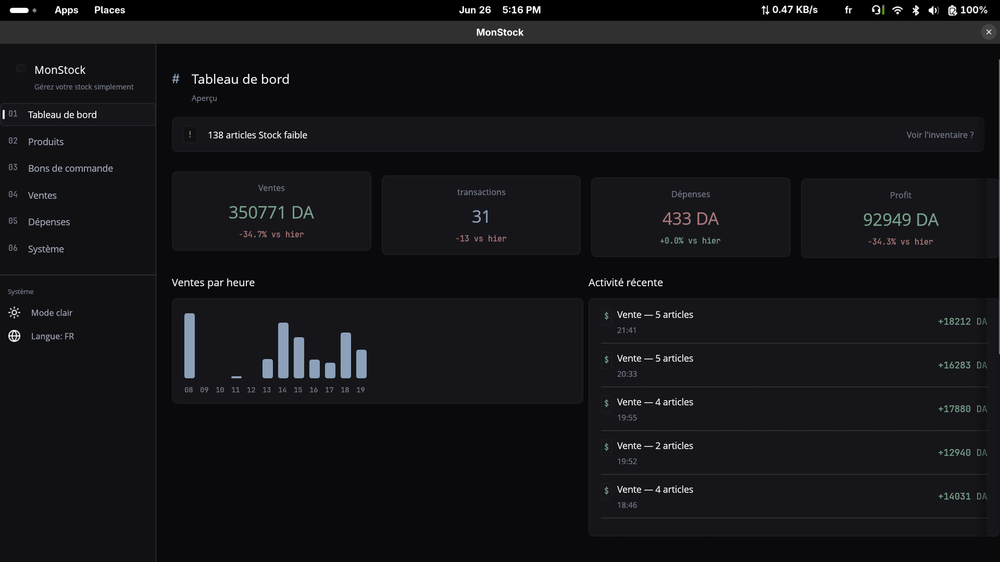
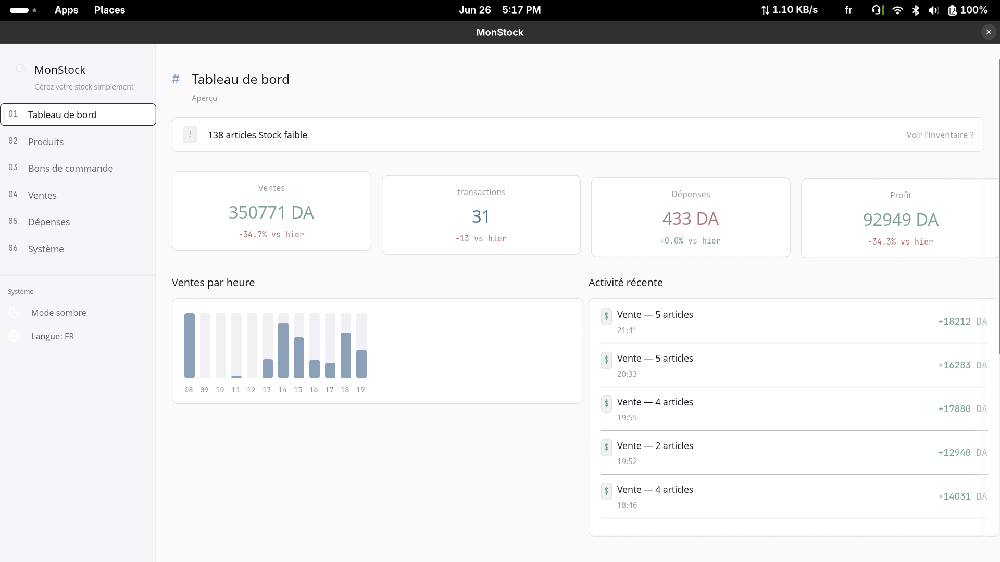

# MonStock

Inventory & sales management for small shops. Rust + egui + SQLite. Offline, cross-platform, open source.

## Screenshots

| Dark mode | Light mode |
|---|---|
|  |  |

## Features

- Stock tracking with low-stock alerts and barcode support
- Purchase orders (create, receive, auto-update stock)
- Sales recording with cost/profit tracking
- Daily dashboard: profit/loss, sales chart, stats cards
- Expenses with categories and date filtering
- French / English interface
- Dark / light theme
- Daily automatic backups + manual backup
- Pagination on all list screens

## Download

Grab the latest binary from [Releases](https://github.com/samir1498/MonStock/releases).

| Platform | Binary |
|---|---|
| Linux | `monstock-x86_64-unknown-linux-gnu` |
| Windows | `monstock-x86_64-pc-windows-msvc.exe` |
| macOS | `monstock-x86_64-apple-darwin` |

Linux: needs `libxcb1-dev` and `libgtk-3-dev`.

## Build from source

```bash
git clone https://github.com/samir1498/MonStock
cd MonStock
cargo run -p monstock-desktop --release
```

Seed demo data: `cargo run --bin seed`

## Project structure

```
MonStock/
├── Cargo.toml                  # workspace root
├── monstock-core/              # lib — models, repos, services (no GUI)
├── monstock-desktop/           # binary — egui frontend
└── docs/                       # design references
```

Business logic is GUI-agnostic — could be reused for CLI, Tauri, or web frontends.

## Built with

| | |
|---|---|
| Language | Rust |
| GUI | egui / eframe |
| Database | SQLite + Diesel ORM |
| Fonts | OpenSans + JetBrains Mono |

## License

MIT
